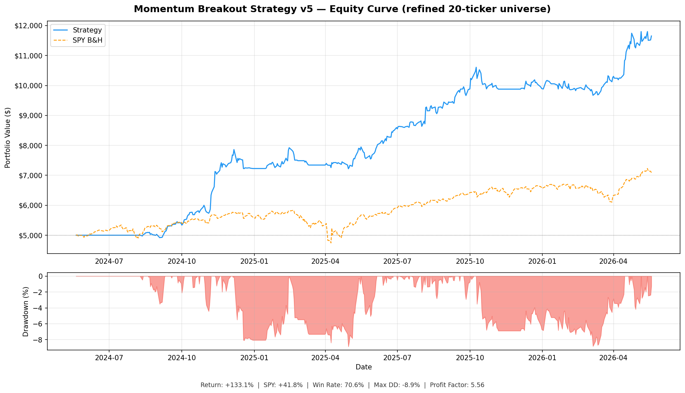

# Momentum Breakout Trading Agent

An automated end-of-day paper trading system built in Python. Scans 20 high-momentum tickers every day at 4:30 PM ET, executes a rules-based breakout strategy via the Alpaca paper trading API, and sends real-time Telegram alerts on every trade event.

---

## Backtest Results — 2 Years (May 2024 – May 2026)



| Metric | Strategy | SPY (buy & hold) |
|---|---|---|
| Total return | **+133.06%** | +41.79% |
| Alpha | **+91.27%** | — |
| Total trades | 68 | — |
| Win rate | 70.6% | — |
| Avg winner | +27.29% | — |
| Avg loser | -5.32% | — |
| Profit factor | 5.56 | — |
| Max drawdown | -8.86% | — |

Starting capital: $5,000 · Risk: 2% per trade · Max 4 open positions

<details>
<summary>Per-ticker breakdown</summary>

| Ticker | Trades | Win Rate | Total P&L | Share |
|--------|--------|----------|-----------|-------|
| SHOP | 6 | 83.3% | $1,162.74 | 17.5% |
| APP | 2 | 100.0% | $954.00 | 14.3% |
| ARM | 5 | 40.0% | $844.28 | 12.7% |
| IONQ | 4 | 100.0% | $761.00 | 11.4% |
| HOOD | 6 | 83.3% | $553.47 | 8.3% |
| MSTR | 2 | 100.0% | $419.76 | 6.3% |
| AFRM | 4 | 100.0% | $363.30 | 5.5% |
| SOFI | 5 | 40.0% | $330.18 | 5.0% |
| CELH | 2 | 100.0% | $328.03 | 4.9% |
| ASTS | 10 | 60.0% | $311.66 | 4.7% |
| PLTR | 5 | 60.0% | $239.12 | 3.6% |

</details>

---

## Strategy

**Universe:** 20 high-momentum growth stocks screened for liquidity

**Entry — all 5 conditions must be true:**
1. Close > 20-day resistance (breakout confirmation)
2. Volume ≥ 1.5× the 20-day average
3. RSI(14) between 50 and 70 (momentum zone, not overbought)
4. Price above both the 20 EMA and 50 SMA (trend alignment)
5. MACD line above signal line (momentum confirmation)

**Tiered exit system:**
- **Stop loss** — 1.5× ATR below entry, hard floor
- **Target 1** — sell 50% at 2× ATR profit; stop moves to breakeven
- **Target 2** — trail remaining 50% using the 20 EMA; exit on close below

This structure locks in partial profits while letting winners run.

---

## Architecture

```
momentum_backtest.py     # Strategy research and backtesting
trading_agent/
├── run.py               # Orchestrator — schedules and runs the pipeline
├── scanner.py           # EOD scan — checks 5 entry conditions across all tickers
├── agent.py             # Position manager — entries and exits via Alpaca API
├── tracker.py           # Trade logger — appends closed trades, prints summary
└── alerts.py            # Telegram sender — notifies on every trade event
```

**Daily pipeline (4:30 PM ET, market days only):**
```
scanner.py  →  setups.json   →  agent.py  →  positions.json  →  tracker.py  →  alerts.py
  (scan)        (signals)       (orders)       (state)           (log)         (notify)
```

---

## Tech Stack

- **Python 3.11+**
- **[Alpaca Markets API](https://alpaca.markets)** — paper trading brokerage
- **[yfinance](https://github.com/ranaroussi/yfinance)** — EOD market data
- **pandas / numpy** — data processing and indicator calculation
- **APScheduler** — market-hours scheduling
- **Telegram Bot API** — real-time trade alerts

---

## Quick Start

```bash
git clone https://github.com/seandaly459-oss/trading-agent.git
cd trading-agent/trading_agent

pip install -r requirements.txt

cp .env.example .env
# Edit .env with your Alpaca paper trading keys and Telegram bot token

python run.py --now    # run once immediately to test
python run.py          # start the scheduler (runs daily at 4:30 PM ET)
```

See [`trading_agent/README.md`](trading_agent/README.md) for full setup instructions including how to create an Alpaca paper account, configure a Telegram bot, and run as a background service.

---

## Run the Backtest

```bash
pip install yfinance pandas numpy matplotlib
python momentum_backtest.py
```

Outputs `backtest_summary_v5.txt`, `backtest_trades_v5.csv`, and `backtest_equity_curve_v5.png`.

---

*Paper trading only. Past backtest performance does not guarantee future results.*
